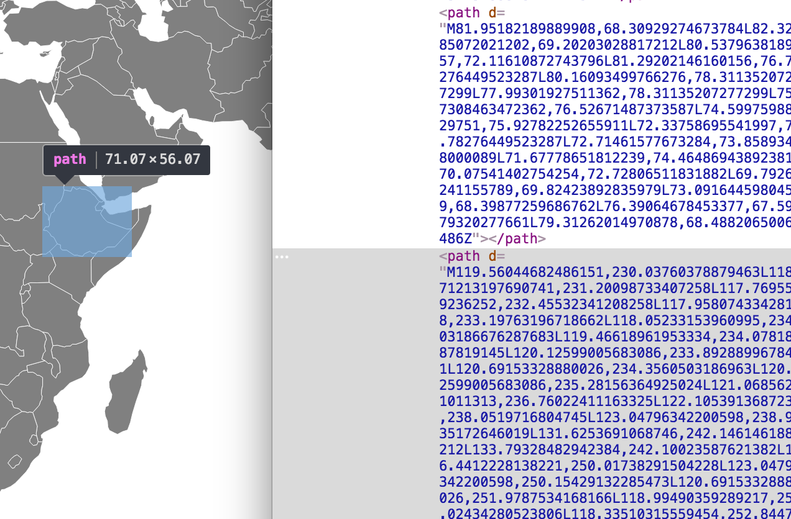

# Maps

In this module, we'll explore different approaches for building maps on the web, including [Leaflet.js](http://leafletjs.com/), and (of course) [D3.js](https://d3js.org/).

Helpful links:

- [Leaflet.js](http://leafletjs.com/) _(Leaflet Docs)_
- [Plotly.js Maps](https://plot.ly/javascript/#maps) _(Plotly Docs)_
- [Let's make a Map](https://bost.ocks.org/mike/map/) _(Bostock Tutorial)_
- [Let's make a Bubble Map](https://bost.ocks.org/mike/bubble-map/) _(Bostock Tutorial)_
- [Topojson Docs](https://github.com/mbostock/topojson/wiki) _(Bostock wiki)_
- [Openstreetmap](https://www.openstreetmap.org) _(free map tiles)_
- [Mapbox](https://www.mapbox.com/) _(free map tiles, some limitations)_
- [D3 Map Projections](https://github.com/mbostock/d3/wiki/Geo-Projections) _(D3 Wiki)_
- [Converting from shapefiles to geojson](http://vallandingham.me/shapefile_to_geojson.html) _(Vallandingham)_
- [Shapefiles](https://doc.arcgis.com/en/arcgis-online/reference/shapefiles.htm) _(ArcGIS Docs)_

## What _is_ a map?
It's important to consider the HTML/SVG elements that constitute different maps in order to build them. Depending on your approach, the elements that you use to represent geographies and spatial data may be quite different. For example, using the [Leaflet.js](http://leafletjs.com/) library, you'll stitch together **map tiles** (small `` elements of geographies) to display your map:


However, if you use D3.js to build your map, `<path>` elements are used to display geographies:



As you can imagine, the approaches for constructing these maps are quite different, and come with their own affordances and challenges.

## Leaflet.js
Leaflet.js is a popular and easy to use tool for building maps on the web. It represents a map by intelligently stitching together **maptiles** from a server such as [Openstreetmap](https://www.openstreetmap.org) or [Mapbox](https://www.mapbox.com/) (or you could run your maptile server!). Leaflet then provides an API for using latitude and longitude to place additional data markers on top of the maptiles to represent your data. Note, you can use the API for arranging spatial (lat/long) data _without_ placing it on top of maptiles -- they just help provide context for your markers.

Leaflet allows you to group elements into different **layers**, which you can add and remove to your map at ease (they provide some nice controls to do this for you). Here is an example of building a simple Leaflet map:

```javascript
// Create a container for your map, and specify the view with a [lat, long] array and a zoom level
var map = L.map('container').setView([40.44694705960048,-97.03125],4)

// Create an tile layer variable using the appropriate url
var tileLayer = L.tileLayer('http://{s}.tile.osm.org/{z}/{x}/{y}.png')

// Add the layer to your map
tileLayer.addTo(map)
```

In the above code section, the URL specified in the `L.tileLayer` function designates the server that should be accessed to retrieve the maptiles based on the lat/long and zoom of the map. Each time the user pans or zooms the map, Leaflet will request the appropriate (new) maptiles to draw your map. To add a marker to your map, you can easily create a new `marker` and add it to your map.

```javascript
// Create a new marker at a specified [lat,long] and add it to the map
var marker = L.marker([51.5, -0.09]).addTo(map);
```

Note, you may want to create a _layer_ that holds your markers and add your markers to your _layer_ -- this will facilitate easily adding and removing groups of markers.

For practice working with the Leaflet.js library, see [exercise-1](http://github.com/info474-s17/m17-maps/tree/master/exercise-1).


## D3 Maps
As with other chart types, making maps in D3 is both more challenging and more customizable. In order to understand the steps necessary for building a map in D3, we'll first have to discuss **map projections** and **data types**.

### Map projections
Map projections provide a way to translate from a 3D space to a 2D space. Through this translation, a map's accuracy is jeopardized, and tradeoffs are made regarding the preservation of _area_, _angle_, _distance_, and other properties. I find [this visual](http://bl.ocks.org/mbostock/5731632) helpful in wrapping my mind around the role of map projections:


However, this **is not** a lesson about which map projection to choose. If you'd like to explore the different [D3 Projections](https://github.com/mbostock/d3/wiki/Geo-Projections), I suggest playing around with this [interactive bl.ock](http://bl.ocks.org/mbostock/3711652). The point here is to underscore that, when building the geogrphaies of your map, you'll be using a specific projection. We'll discuss this more below, but you may be using a file that _already has a projection_, or you may have to specify your map projection using this syntax:

```javascript
// A path generator that you'll use to draw your paths
var path = d3.geo.path();

// Return a projection function
var projection = d3.geo.mercator();

// Specify that you want to use your projection in drawing your path elements
path.projection(projection);

// All in one line: this is the same as the lines above:
var path = d3.geo.path()
                 .projection(d3.geo.mercator());

```

The section above gives you the tools necessary (namely the `path` function), for drawing geographies in an `<svg>` element. However, the question still remains, what does that data look like?

### Map Data
Geographic data is common stored in vector format in [shapefiles](https://doc.arcgis.com/en/arcgis-online/reference/shapefiles.htm). These files store various information (including location) of spatial elements, and are commonly used by mapping programs such as [ArcGIS](https://www.arcgis.com/features/). However, in order to use them on the web, we'll need to convert them into `.json` files that we can easily read an manipulate using JavaScript. There are two more specific data types used for reading geographic data on the web:

>**GeoJSON** is a "format for encoding a variety of geographic data structures" ([geojson.org](http://geojson.org/)).

As you might expect, GeoJSON objects are JSON objects that follow conventions for specifying element types and attributes:

```javascript
// Example from geojson.org
{
  "type": "Feature",
  "geometry": {
    "type": "Point",
    "coordinates": [125.6, 10.1]
  },
  "properties": {
    "name": "Dinagat Islands"
  }
}
```
In [these](https://bost.ocks.org/mike/map/) [three](https://bost.ocks.org/mike/bubble-map/) [tutorials](http://vallandingham.me/shapefile_to_geojson.html), there is ample information on **where to find data** (in shapefile format), and **how to convert it to geojson**. Once your data is properly formatted as a GeoJSON object, the `d3.geo.path` will be able to easily render your graphic.

Recently, another format, **TopoJSON**, has grown substantially in popularity. The [documentation](https://github.com/mbostock/topojson) provides both a brief overveiw and a strong argument in favor of using this file format (emphasis added):

> **TopoJSON** is an extension of GeoJSON that encodes topology. Rather than representing geometries discretely, geometries in TopoJSON files are stitched together from shared line segments called arcs. TopoJSON eliminates redundancy, offering much more compact representations of geometry than with GeoJSON; typical TopoJSON **files are 80% smaller** than their GeoJSON equivalents

This [tutorial](https://bost.ocks.org/mike/bubble-map/) provides excellent step-by-step instructions on how to use command-line tools to build TopoJSON files. Interestingly, you can specify your projection **when you build your TopoJSON file**, making it unnecessary to specify a projection when using D3. Here is the command-line snipit suggested:

```
# From https://bost.ocks.org/mike/bubble-map/
build/counties.json: build/gz_2010_us_050_00_20m.shp
	node_modules/.bin/topojson \
		-o $@ \
		--projection='width = 960, height = 600, d3.geo.albersUsa() \
			.scale(1280) \
			.translate([width / 2, height / 2])' \
		--simplify=.5 \
		-- counties=$<
```

There are a number of _huge_ advantages to working with TopoJSON. For example, your can stitch boundaries together, making any set of element into a **single path**. For example, if you aggregated up to the county level, you could have a single `<path>` element representing all U.S. counties, which you could easily add to your page as follows:

```javascript
// Specify path drawing function with no projection, because the TopoJSON file (mapFile) is already projected
var path = d3.geo.path()
    .projection(null);

// Append a single path element for all us counties
svg.append("path")
      .datum(topojson.mesh(mapFile))
      .attr("d", path);
```

However, if you want each element to have a different color, or a different hover event, you would need to get seperate elements out of your TopoJSON object, and perform a data-join as usual:

```javascript
// Specify path drawing function with no projection, because the TopoJSON file (mapFile) is already projected
var path = d3.geo.path()
    .projection(null);

// Get the `county` objects our of your TopoJSON file
var counties = topojson.feature(mapFile, mapFile.objects.counties).features

// Paths -- one for each county
var paths = svg.selectAll("path")
    .data(counties);

// Enter and append paths, then draw their shape by specifying the `pathGen` funciton for the `d` attribute
paths.enter().append('path')
    .attr("class", "border border--state")
    .attr("d", pathGen)
```
