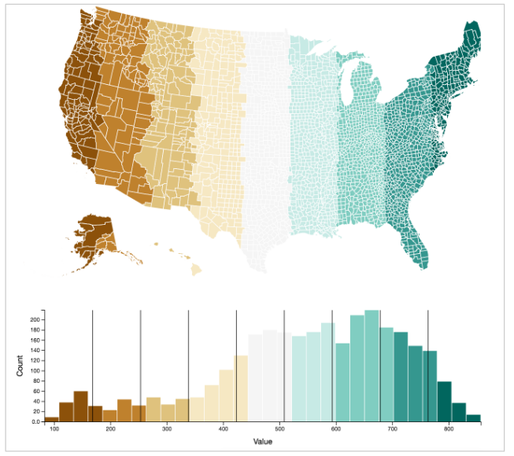

## Demo-1: Choosing Map Scales

This demo allows you to explore the impact of using Quantile and Quartile scales for shading a map. It also allows you to view all color pallettes from [ColorBrewer](http://colorbrewer2.org/). Simply fork and clone this repository, then run a local server to see it in your browser.

Note, the code **does not follow suggested reusability patterns** as described in [Module-10](https://github.com/INFO-474/m10-reusability). This was largely to prevent providing students with answers to a related assignment.
