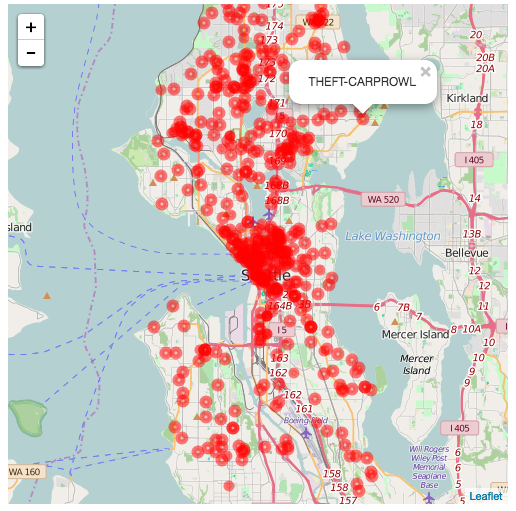

## Exercise-1: Building a Leaflet.js Map

This exercise is a short example of how to build a Leaflet.js map, and visualize data obtained through an AJAX request. The AJAX request suggested uses an API developed by [data.seattle.gov](https://data.seattle.gov/) to expose real-time crime reporting information.

You may find the following resources helpful:

- [Leaflet.js](http://leafletjs.com/) _(Leaflet Docs)_
